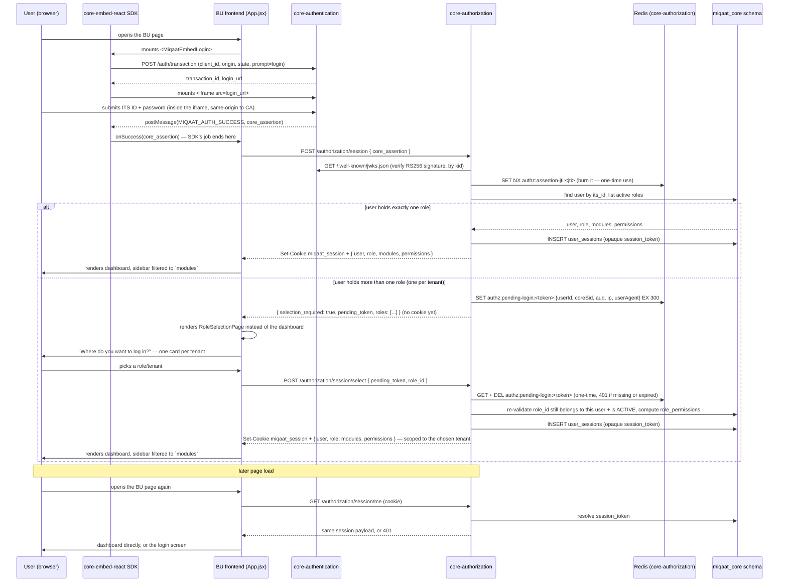

# Miqaat Core — Embedded Federation Login POC

Written for: the dev team picking this up after the initial proof-of-concept build.

This is a working, end-to-end proof of concept of the embedded federation login flow described in
`miqaat_core_embedded_federation_authentication_architecture_nestjs_signing_v2.md`, plus a new React SDK
(`core-embed-react`) and a minimal local-session + permission-gated dashboard demo built on top of it.

Three projects, each its own git repo, sitting side by side in this folder:

```
miqaat-core/
├── core-authentication/    the identity provider - login, JWKS, federation sessions, and (moved here)
│                           the federation client/origin/callback registry
├── core-authorization/     RBAC, and (new) the Core Admin Panel's local session
└── core-embed-react/       the new React SDK + a runnable example app
```

Two other docs live next to this one:

- [`HANDOFF.md`](./HANDOFF.md) — what was built, why, and the key decisions to understand before changing anything
- [`PRODUCTION_READINESS.md`](./PRODUCTION_READINESS.md) — the gap list between this POC and something shippable

## 1. What this demonstrates

A Business Unit page embeds Core's login iframe via the `core-embed-react` SDK, the user signs in with
their ITS ID, and the resulting signed assertion is handed to `core-authorization`, which verifies it
against `core-authentication`'s JWKS, establishes a **local, stateful session** (a new
`miqaat_core.user_sessions` table — opaque cookie, not a JWT, so it's actually revocable), and returns the
real, DB-computed set of modules/permissions that session's role holds. The example frontend renders a
dashboard whose sidebar only shows modules the signed-in role actually has a grant for.

`core-authentication` itself — origin verification, CSP, password check, assertion signing — has **no
runtime dependency on `core-authorization` or any other authorization service**; it owns its own client/
origin/callback registry (§4.1). Only the later local-session step (`POST /authorization/session`) involves
`core-authorization`. See `HANDOFF.md` §8 for how this was verified (by actually stopping `core-authorization`
mid-demo).

## 2. Sequence diagram

Two frontend participants on purpose: **SDK** is the `core-embed-react` package (`<MiqaatEmbedLogin>` — just
the transaction + iframe + postMessage handoff), **App** is the BU's own frontend code
(`core-embed-react/example/src/App.jsx` + `RoleSelectionPage.jsx` today). The multi-role picker is **App**'s
responsibility, not the SDK's — the SDK's job is done the moment it hands over `core_assertion`. That split
is deliberate to call out below the diagram.



**Open question this raises for further steps:** today `RoleSelectionPage` is hand-built inside the example
app — every Business Unit that wants multi-tenant users would need to build this screen themselves against
the raw `selection_required` / `pending_token` contract. Worth deciding whether that picker (or at least its
logic — call `/session`, branch on `selection_required`, call `/session/select`) should move *into* the SDK
as a second exported component (e.g. `<MiqaatTenantSelect>`), the way `<MiqaatEmbedLogin>` already is, so
BUs get it for free instead of re-implementing it. See `PRODUCTION_READINESS.md`.

## 3. Prerequisites

- Docker Desktop running (`open -a Docker` on macOS, then wait for it)
- Node ≥ 22 for `core-authentication`/`core-authorization`, Node ≥ 18 for `core-embed-react`
- Each repo's `.env` present and filled in (`.env.example` is committed; `.env` is not — copy it once and
  fill in the values, in particular `DEV_DEMO_PASSWORD` in `core-authentication/.env`, which is otherwise
  blank and is required for the demo login to work at all)
- **The right branch checked out in each repo — none of this exists on `main` yet.** `main` in both
  `core-authentication` and `core-authorization` predates this entire POC (and even the feature branches it
  was built on top of):

  | Repo | Branch to check out |
  |---|---|
  | `core-authentication` | `feature/local-client-registry` |
  | `core-authorization` | `feature/local-session-multi-role-selection` |
  | `core-embed-react` | `main` (already fully pushed there — no checkout needed) |

  ```bash
  cd core-authentication && git checkout feature/local-client-registry
  cd ../core-authorization && git checkout feature/local-session-multi-role-selection
  ```

  Neither branch is merged yet — treat this as a PR-review-ready state, not a `main`-ready one.

## 4. Run it — exact order

### 4.1 `core-authentication`

```bash
cd core-authentication
npm install
npm run infra:up          # postgres + redis + localstack (dev Secrets Manager)
npm run migration:run     # includes AuthClients - see HANDOFF.md §8
npm run keys:generate      # writes the RS256 signing keyset into localstack
npm run seed:dev-users     # creates the 4 demo ITS IDs used below
npm run seed:clients       # registers rms-web-dev + its one allowed origin (localhost:5175) - owned here now
npm run start:dev          # http://localhost:3001
```

Need to add another origin later? `npm run client -- origins add rms-web-dev https://your-new-origin` —
same CLI shape as before, just local to this repo now. `npm run client -- show rms-web-dev` prints the
full current config (origins + callbacks) if you want to double-check what's actually registered.

### 4.2 `core-authorization`

```bash
cd core-authorization
npm install
npm run infra:up          # its own postgres + redis
npm run migration:run     # includes MiqaatCoreSchema + MiqaatCoreUserSessions - see HANDOFF.md
npm run seed               # base catalog: business units, applications - core-authorization's own concerns
npm run seed:miqaat-core-demo    # the Core Admin Panel demo personas, see §5 below
npm run start:dev          # http://localhost:3002
```

### 4.3 `core-embed-react`

```bash
cd core-embed-react
npm install
npm run build              # produces dist/ - the example imports it via file:..

cd example
npm install
npm run dev                 # http://localhost:5175
```

Open **http://localhost:5175**. There is no separate backend to run for the example app — the frontend
talks to `core-authentication` and `core-authorization` directly.

## 5. Test credentials

All four ITS IDs come from `core-authentication/scripts/seed-dev-users.ts` (same every run, hardcoded).
The password is whatever `DEV_DEMO_PASSWORD` is set to in your own `core-authentication/.env` — on this
machine right now that's `CFtOLN169LA-`; a fresh checkout will have whatever you set it to.

| ITS ID | miqaat_core role(s) | What you'll see |
|---|---|---|
| `31267890` | Platform Administrator (`CORE_ADMIN`, full access) | Single role — signs straight in. Sidebar: all 11 modules |
| `31189012` | RMS / VMS / AMS Demo Admin (`BUSINESS_UNIT_ADMIN`, full access) — **one role per tenant, three tenants** | Multi-role — lands on "Where do you want to log in?" first. Pick any tenant, sidebar: 8 modules scoped to that tenant (no Business Unit / Utility / Mumin — Core-only) |
| `31145678` | RMS Support Staff (`BUSINESS_UNIT_ADMIN`, limited) | Single role — signs straight in. Sidebar: Dashboard, Audit Log, Ticket Management only |
| `31278901` | *(none seeded)* | Real assertion, but `POST /authorization/session` returns `403 USER_NOT_ONBOARDED` — a working negative-path test |

All four use the same password. There's also a Non-ITS demo user created by `seed-dev-users.ts`
(`NITS-...`, printed when that script runs) — not relevant to this flow, it's a different login path.

## 6. Troubleshooting

- **Docker daemon not running** → both `infra:up` commands fail with a socket error; start Docker Desktop first.
- **`ORIGIN_NOT_ALLOWED` from `core-authentication`** → `npm run seed:clients` (§4.1) wasn't run, or you're
  running the example on a port other than `5175`.
- **`USER_NOT_ONBOARDED`** → the ITS ID you logged in with has no `miqaat_core.users` row — expected for
  `31278901`, otherwise re-run `npm run seed:miqaat-core-demo`.
- **CORS error in the browser console** → confirm both services picked up `bootstrap.ts`'s CORS hooks (a
  `nest start --watch` restart is automatic on save; check the terminal log for "Found 0 errors").
- **Login form doesn't reappear after "Sign out"** → confirms `prompt: 'login'` isn't reaching
  `core-authentication`; see `HANDOFF.md`'s note on this fix.
- **`SELECTION_EXPIRED` on the role-selection screen** → the `pending_token` is one-time and expires after 5
  minutes (Redis); refresh and sign in again from scratch. Expected if you leave that screen open too long,
  or hit "Continue" twice.

## 7. Debugging queries — validate what's actually in the containers

Every command below was run against the actual local stack while building this, not written from memory.
Container names come from each repo's `docker/docker-compose.yml`; run `docker ps` if yours differ.
Postgres commands read the password straight out of your own `.env` — never hardcode it into a command you
might paste somewhere shared.

### Postgres — `core-authentication` (`miqaat-authn-postgres`, db/user `miqaat_auth`)

```bash
cd core-authentication
PW=$(grep '^POSTGRES_PASSWORD=' .env | cut -d= -f2)

# Registered clients and their allowed embed origins (should be just rms-web-dev / localhost:5175 - see HANDOFF.md)
docker exec -e PGPASSWORD="$PW" miqaat-authn-postgres psql -U miqaat_auth -d miqaat_auth -c "
  SELECT c.client_id, c.name, c.status, c.authentication_mode, o.origin
  FROM auth_clients c JOIN auth_client_origins o ON o.client_ref = c.id
  ORDER BY c.client_id, o.origin;"

# Callback / logout URIs registered for a client
docker exec -e PGPASSWORD="$PW" miqaat-authn-postgres psql -U miqaat_auth -d miqaat_auth -c "
  SELECT c.client_id, cb.uri_type, cb.uri, cb.is_primary
  FROM auth_clients c JOIN auth_client_callbacks cb ON cb.client_ref = c.id
  WHERE c.client_id = 'rms-web-dev' ORDER BY cb.uri_type;"
```

Equivalent without touching SQL directly: `npm run client -- show rms-web-dev`.

### Postgres — `core-authorization` (`miqaat-authz-postgres`, db/user `miqaat_authz`)

```bash
cd core-authorization
PW=$(grep '^POSTGRES_PASSWORD=' .env | cut -d= -f2)

# Every role a user holds, one row per tenant - this is what decides selection_required (>1 row = the
# "Where do you want to log in?" screen fires; see README §2's diagram and HANDOFF.md §9)
docker exec -e PGPASSWORD="$PW" miqaat-authz-postgres psql -U miqaat_authz -d miqaat_authz -c "
  SELECT u.its_id, u.name, r.role_code, r.role_level, t.name AS tenant_name
  FROM miqaat_core.user_roles ur
  JOIN miqaat_core.users u ON u.id = ur.user_id
  JOIN miqaat_core.roles r ON r.id = ur.role_id
  LEFT JOIN miqaat_core.tenants t ON t.id = r.tenant_id
  WHERE u.its_id = '31189012'
  ORDER BY t.name;"

# Last 10 local sessions (miqaat_core.user_sessions), newest first - which role/tenant each was scoped to,
# and whether it's still live (revoked_at IS NULL AND expires_at > now())
docker exec -e PGPASSWORD="$PW" miqaat-authz-postgres psql -U miqaat_authz -d miqaat_authz -c "
  SELECT u.its_id, u.name, r.role_code, t.name AS tenant_name, s.created_at, s.expires_at, s.revoked_at
  FROM miqaat_core.user_sessions s
  JOIN miqaat_core.users u ON u.id = s.user_id
  JOIN miqaat_core.roles r ON r.id = s.role_id
  LEFT JOIN miqaat_core.tenants t ON t.id = r.tenant_id
  ORDER BY s.created_at DESC LIMIT 10;"
```

### Redis — `core-authorization` (`miqaat-authz-redis`, no auth, port 6392)

Both key families here are short-lived by design — expect an empty result unless you check right after a
login. `authz:assertion-jti:*` proves the `core_assertion` replay guard is working (§ diagram: burned the
instant `AssertionVerifierService` verifies it, ~60s TTL matching the assertion's own `exp`).
`authz:pending-login:*` only exists between a multi-role `POST /authorization/session` and the follow-up
`POST /authorization/session/select` (5 min TTL).

```bash
# List whichever of the two key families currently exist
docker exec miqaat-authz-redis redis-cli KEYS "authz:assertion-jti:*"
docker exec miqaat-authz-redis redis-cli KEYS "authz:pending-login:*"

# Inspect one pending-selection token's payload and remaining TTL (seconds)
docker exec miqaat-authz-redis redis-cli GET "authz:pending-login:<token>"
docker exec miqaat-authz-redis redis-cli TTL "authz:pending-login:<token>"
```

Verified output from a real multi-role login (`31189012`), captured mid-flow before selecting a tenant:

```
$ docker exec miqaat-authz-redis redis-cli GET "authz:pending-login:ipT69-BkAfIRsDQnsxeYip4_-CP7rnfLBu9CmbZdwlc"
{"userId":"8e15ba40-382f-462a-a5b9-58ceb2ba8b25","itsId":"31189012","coreSid":"sid_4dSRy4wBobJzwBL161LgcNj2","aud":"rms-web-dev","ipAddress":"127.0.0.1","userAgent":"curl/8.7.1"}
$ docker exec miqaat-authz-redis redis-cli TTL "authz:pending-login:ipT69-BkAfIRsDQnsxeYip4_-CP7rnfLBu9CmbZdwlc"
295
```

### Redis — `core-authentication` (`miqaat-authn-redis`, no auth, port 6391)

A different concern — this is the federation SSO session (unrelated to the local `miqaat_core` session
above), keyed by the cookie handle from the login iframe. Useful when debugging `prompt: 'login'` /
"Continue as X" behavior (`HANDOFF.md` §6):

```bash
docker exec miqaat-authn-redis redis-cli KEYS "federation:*"
# federation:session-handle:<handle>   - the federation session itself
# federation:user-sessions:<its_id>    - reverse index, which session(s) this ITS ID is signed into
# federation:session-clients:<sid>     - which client_ids this session has already issued an assertion for
```
